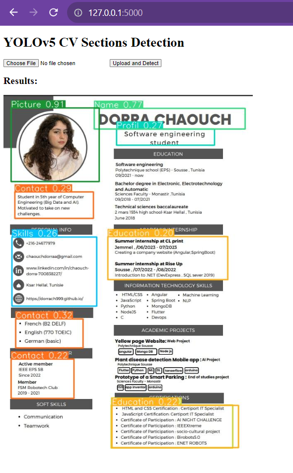

# cv-section-detection-yolov5
# YOLOv5 Curriculum Vitae Section Detection Model

This repository contains code for training a custom YOLOv5 model to detect and label different sections of a Curriculum Vitae (CV). The model is then deployed in a web application using Flask.

## Custom Data Preparation

1. **Data Collection:**
   - The dataset was created using custom data with labeled CV sections.
   - Raw data was obtained from [this Google Drive link](https://drive.google.com/drive/folders/16rtlLrbjtRNnqWQVCSblqB1Gneos68kP?usp=sharing).

2. **Data Processing:**
   - JSON labels from the dataset were converted to YOLOv5-compatible .txt format using Roboflow.
   - The dataset was split into training (80%) and validation (20%) sets.

3. **Data Organization:**
   - The processed data was organized into 'train' and 'val' folders in the 'custom_data' directory of YOLOv5.
   - A configuration file (`cvdata.yaml`) was created to specify the dataset information.

```yaml
train: ../custom_data/train  
val: ../custom_data/val
nc: 12
names: ['Certifications', 'Community', 'Contact', 'Education', 'Experience', 'Interests', 'Languages', 'Name', 'Picture', 'Profil', 'Projects', 'Skills']
```

4. **Model Training:**
   - Training was performed using the following command:
     ```bash
     !python train.py --device 0 --batch-size 16 --epochs 150 --img 640 --data data/cvdata.yaml --cfg models/yolov5m.yaml --weights yolov5m.pt --name yolov5_cv_train
     ```

5. **Training Results:**
 
    
   - Training and testing details are documented in the [yolov5_CV_model.ipynb](yolov5_CV_model.ipynb) file.

## Model Deployment with Flask

The trained model is deployed in a Flask web application for easy usage.

1. **Web page uploading and detection**
   
   
   

3. **Dependencies Installation:**
   - Ensure you have the required dependencies for YOLOv5 installed.

4. **Launch the Web App:**
   - Run the following command to start the Flask application:
     ```bash
     python app.py
     ```
   - Visit [http://localhost:5000/](http://localhost:5000/) in your browser.

5. **Testing the Model:**
   - Choose a CV file and test the model to detect and label CV sections.

## Additional Resources

- YOLOv5 Repository: [https://github.com/ultralytics/yolov5.git](https://github.com/ultralytics/yolov5.git)
- Trained Model and Data: [Google Drive](https://drive.google.com/drive/folders/11sbYJ2cHkWV5kfiCS6hDSsrNhzuQZWMD?usp=sharing)

